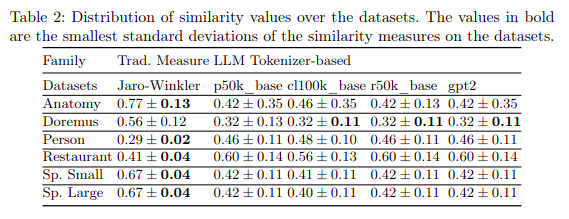
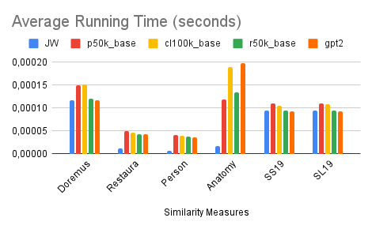

# Similarity Study between Traditional and tokenizer-based approaches :dizzy:

> Install Python :snake: (>=3.8) and dependencies.

    python -m pip install -r ./requirements.txt

> Important to do :

    - Unzip the data in the 'inputs' directory and move them into the root of 'inputs' directory

    - If you don't want to re-run evaluations, just open the 'outputs' directory and read the results.

## 1. Generate the similarity distribution :

> 1.1. Reproduce the comparison between traditional and tokenizer-based approaches and draw the curve:

    $ ./job.sh

> 1.2. Produce the array with mean and standard deviation (mean_std.txt):

    $ ./job_mean_std.sh

> Table of results :

> Running time results :

> 
